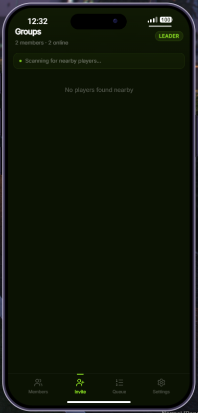

# Groups app for prp-bridge groups & party system

A simple phone app for managing prp-bridge groups and parties on the go. 
Players can create groups, invite nearby players, manage members, and track queue status.

## Screenshots

<p align="center">
  
  
  
</p>
<p align="center">
  
  
  
</p>

## Features

- **Create & manage groups** -- create, join, leave, disband
- **Member management** -- view online/offline status, kick members (leader)
- **Proximity invites** -- scan for nearby players and send invites
- **Queue status** -- see which queue your party is in and your position
- **Group settings** -- toggle inviting, lock/unlock group (leader)
- **Real-time updates** -- member joins, leaves, and disbands sync instantly
- **Themeable** -- colors configurable via `config/theme.lua`

## Dependencies

- [ox_lib](https://github.com/CommunityOx/ox_lib)
- [prp-bridge](https://github.com/ProdigyPRP/prp-bridge)
- A supported phone resource (lb-phone, yseries, yphone, yflip, gksphone)

## Installation

1. Drop `fd_prp_groups` into your resources folder
2. Add `ensure fd_prp_groups` to your `server.cfg` (after `prp-bridge` and `lb-phone`)
3. Restart your server

## Configuration

### `config/general.lua`

| Option | Type | Default | Description |
|--------|------|---------|-------------|
| `appId` | string | `fd_prp_groups` | lb-phone app identifier |
| `appName` | string | `Groups` | Display name in the phone |
| `defaultApp` | boolean | `false` | Show on phone home screen by default |
| `nearbyRadius` | number | `25.0` | Distance (units) to scan for nearby players |
| `isDevelopment` | boolean | `false` | Enable dev mode (Vite dev server + mock data) |

### `config/theme.lua`

All colors use RGB triplet format (e.g. `"135 218 33"`). Default theme uses PRP brand colors.

## Development

```bash
cd web
pnpm install
pnpm run dev       # Start Vite dev server with mock data
pnpm run build     # Build for production
```

Set `isDevelopment = true` in `config/general.lua` and update the dev server IP in `bridge/integrations/lb-phone/client.lua` to point to your machine.
